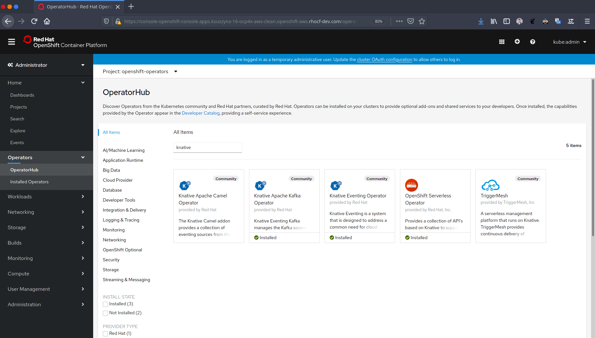

= Knative + Kafka 

== Prerequisites

Assumes you have used try.openshift.com to create an OCP 4.2 cluster.  Here is a quick video that illustrates that process.

https://youtu.be/sK2SWH_m01Y

CLI tools used:

* kubectl
* oc
* jq
* kafkacat
* siege
* watch 

== Installation

Using the OCP 4.x Administration Console - find OperatorHub and install

. Knative Serving
. Knative Eventing
. Knative Kafka
. Strimzi 

image::images/installed_operators.png[Installed Operators]

You can check on your installed operators and their versions: 

----
kubectl get csv
NAME                               DISPLAY                         VERSION   REPLACES                           PHASE
knative-eventing-operator.v0.7.1   Knative Eventing Operator       0.7.1     knative-eventing-operator.v0.6.0   Succeeded
knative-kafka-operator.v0.7.1      Knative Apache Kafka Operator   0.7.1     knative-kafka-operator.v0.6.0      Succeeded
knative-serving-operator.v0.7.1    Knative Serving Operator        0.7.1     knative-serving-operator.v0.6.0    Succeeded
strimzi-cluster-operator.v0.13.0   Strimzi Apache Kafka Operator   0.13.0    strimzi-cluster-operator.v0.12.2   Succeeded
----

NOTE: I have also used the following versions - OpenShift Serverless pulls in ElasticSearch, Jaeger, Kiali
----
kubectl get csv
NAME                                        DISPLAY                          VERSION              REPLACES                            PHASE
elasticsearch-operator.4.3.1-202002032140   Elasticsearch Operator           4.3.1-202002032140                                       Succeeded
jaeger-operator.v1.13.1                     Jaeger Operator                  1.13.1                                                   Succeeded
kiali-operator.v1.0.9                       Kiali Operator                   1.0.9                kiali-operator.v1.0.8               Succeeded
knative-eventing-operator.v0.12.0           Knative Eventing Operator        0.12.0               knative-eventing-operator.v0.11.0   Succeeded
knative-kafka-operator.v0.12.1              Knative Apache Kafka Operator    0.12.1               knative-kafka-operator.v0.11.2      Succeeded
serverless-operator.v1.4.1                  OpenShift Serverless Operator    1.4.1                serverless-operator.v1.4.0          Succeeded
servicemeshoperator.v1.0.7                  Red Hat OpenShift Service Mesh   1.0.7                servicemeshoperator.v1.0.6          Succeeded
strimzi-cluster-operator.v0.15.0            Strimzi                          0.15.0               strimzi-cluster-operator.v0.14.0    Succeeded
----

== Namespace/Project Setup
[source,bash]
----
kubectl create namespace kafka

# make it "sticky"
kubectl config set-context --current --namespace=kakfa

# check that it is set
kubectl config current-context

# or use "oc" to see what the "sticky" namespace is
oc project
----

== Create kafka cluster
[source,bash]
----
cat <<EOF | kubectl apply -f -
apiVersion: kafka.strimzi.io/v1beta1
kind: Kafka
metadata:
  name: my-cluster
spec:
  kafka:
    version: 2.5.0
    replicas: 3
    listeners:
      plain: {}
      tls: {}
    config:
      offsets.topic.replication.factor: 3
      transaction.state.log.replication.factor: 3
      transaction.state.log.min.isr: 2
      log.message.format.version: "2.5"
    storage:
      type: ephemeral
  zookeeper:
    replicas: 3
    storage:
      type: ephemeral
  entityOperator:
    topicOperator: {}
    userOperator: {}
EOF
----

== Configure the Knative Eventing Kafka

Note: this only needs to be done one time
[source,bash]
----
cat <<EOF | kubectl apply -n knative-eventing -f -
apiVersion: eventing.knative.dev/v1alpha1
kind: KnativeEventingKafka
metadata:
  name: knative-eventing-kafka
  namespace: knative-eventing
spec:
  bootstrapServers: 'my-cluster-kafka-bootstrap.kafka:9092'
  setAsDefaultChannelProvisioner: false
EOF
----

Note: the namespace of "kafka" likely

Verify the KnativeEventingKafka took affect

[source,bash]
----
kubectl get crds | grep kafkasource
kafkasources.sources.eventing.knative.dev                   2019-09-21T14:23:14Z
----

and

[source,bash]
----

kubectl get pods -n knative-eventing

NAME                                        READY   STATUS    RESTARTS   AGE
broker-controller-66f988fb6c-6wk4t          1/1     Running   0          20h
eventing-controller-5c955d4694-btwx8        1/1     Running   0          20h
eventing-webhook-7f7bcb8447-27p9s           1/1     Running   0          20h
imc-controller-6ddf4477fd-bjjhh             1/1     Running   0          20h
imc-dispatcher-7676c44559-wzxg4             1/1     Running   0          20h
kafka-ch-controller-5497f498dc-vm8x7        1/1     Running   0          4h19m
kafka-controller-manager-544887898b-j654v   1/1     Running   0          4h20m
kafka-webhook-65d8bb899c-6nsmq              1/1     Running   0          4h19m
----

== Create kafka topic

[source,bash]
----
cat <<EOF | kubectl apply -f -
apiVersion: kafka.strimzi.io/v1alpha1
kind: KafkaTopic
metadata:
  name: my-topic
  labels:
    strimzi.io/cluster: my-cluster
spec:
  partitions: 100
  replicas: 1
EOF
----

Test to see if the topic was created correctly

[source,bash]
----
oc exec -n kafka -it my-cluster-zookeeper-0 -- /bin/bash

bin/kafka-topics.sh --zookeeper localhost:12181 --list

bin/kafka-topics.sh --zookeeper localhost:12181 --describe --topic my-topic
----

OR

[source,bash]
----
kubectl exec -n kafka -it my-cluster-zookeeper-0 -- bin/kafka-topics.sh --zookeeper localhost:12181 --describe --topic my-topic

OpenJDK 64-Bit Server VM warning: If the number of processors is expected to increase from one, then you should configure the number of parallel GC threads appropriately using -XX:ParallelGCThreads=N
Topic:my-topic	PartitionCount:100	ReplicationFactor:1	Configs:message.format.version=2.3-IV1
	Topic: my-topic	Partition: 0	Leader: 2	Replicas: 2	Isr: 2
	Topic: my-topic	Partition: 1	Leader: 0	Replicas: 0	Isr: 0
	Topic: my-topic	Partition: 2	Leader: 1	Replicas: 1	Isr: 1
	Topic: my-topic	Partition: 3	Leader: 2	Replicas: 2	Isr: 2
	Topic: my-topic	Partition: 4	Leader: 0	Replicas: 0	Isr: 0
	Topic: my-topic	Partition: 5	Leader: 1	Replicas: 1	Isr: 1
	Topic: my-topic	Partition: 6	Leader: 2	Replicas: 2	Isr: 2
.
.
.
----

== Deploy a Knative Service

This is your "sink" that receives events

[source,bash]
----
cat <<EOF | kubectl apply -f -
apiVersion: serving.knative.dev/v1
kind: Service
metadata:
  name: myknativesink
spec:
  template:
    metadata:
      annotations:
        autoscaling.knative.dev/target: "1"
        autoscaling.knative.dev/window: 16s
    spec:
      containers:
      - image: docker.io/burrsutter/myknativesink:1.0.1
        resources:
          requests: 
            memory: "50Mi" 
            cpu: "100m" 
          limits:
            memory: "70Mi"
            cpu: "100m"       
        livenessProbe:
          httpGet:
            path: /healthz
        readinessProbe:
          httpGet:
            path: /healthz    
EOF
----

If your pod is stuck in PENDING, check your events

[source,bash]
----
kubectl get events --sort-by=.metadata.creationTimestamp
----

You likely need to add another worker node (OpenShift Console - Compute - MachineSets)

image::images/machinesets.png[Machinesets]

== Create the KafkaSource that connects my-topic to ksvc 
[source,bash]
----
cat <<EOF | kubectl apply -f -
apiVersion: sources.knative.dev/v1alpha1
kind: KafkaSource
metadata:
  name: mykafka-source
spec:
  consumerGroup: knative-group
  bootstrapServers: 
   - my-cluster-kafka-bootstrap.kafka:9092
  topics: 
   - my-topic
  sink:
    ref:
      apiVersion: serving.knative.dev/v1
      kind: Service
      name: myknativesink
EOF
----

You can monitor the logs of kafkasource-mykafka-source to see if it has connectivity issues

----
stern kafkasource-mykafka-source
----

== Test

image::images/hello_world_1.png[Waiting]

image::images/hello_world_2.png[Sink pod is up]

image::images/goodbye_world.png[one more message]

== Scaling beyond 1 Pod

Kafka Spammer is a simple little application that drives in N messages as fast as it can.

Deploy

----
kubectl -n kafka run kafka-spammer \
--image=quay.io/rhdevelopers/kafkaspammer:1.0.2
----

Exec into the Spammer
----
KAFKA_SPAMMER_POD=$(kubectl -n kafka get pod -l "run=kafka-spammer" \
-o jsonpath='{.items[0].metadata.name}')
kubectl -n kafka exec -it $KAFKA_SPAMMER_POD -- /bin/sh
----

----
curl localhost:8080/1
----

Watch the Developer Topology view

image::images/developer_topology.png[Developer View]

image::images/developer_topology_during_auto_scale.png[Developer View]

image::images/iterm_during_100.png[Terminal View]

== Clean up

[source,bash]
----
kubectl delete route kafka-producer
kubectl delete service kafka-producer
kubectl delete deployment kafka-producer
kubectl delete kafkasource mykafka-source
kubectl delete ksvc myknativesink
kubectl delete KafkaTopic my-topic
kubectl delete kafka my-cluster
----

